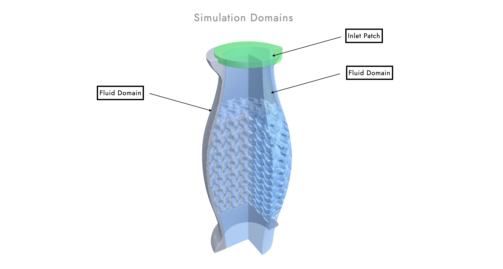
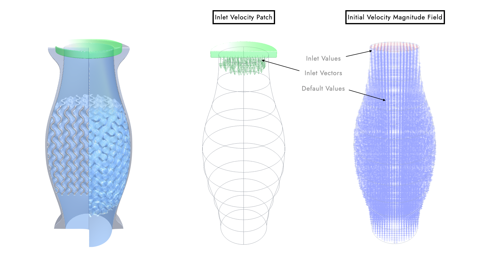

# Simulation Setup with PicoGK

## Why?

Physical simulations require geometric and physical inputs. Traditionally, setting up a simulation is a manual task performed by a human expert, where multiple patches of geometry need to be identified, labeled (e.g. as "inlet" or "wall") and associated with initial physical conditions (e.g. "the flow velocity across this patch is 0.5 m/s"). This often results in multiple files, multiple geometries that need to be somehow overlaid into one coherent initial state of the simulation domain. 

We are publishing this first, very simple example to showcase a new approach to simulation setup using PicoGK. First of all, Computational Engineering Models (CEMs) are not limited to geometric data, but can just as well hold physical performance data. In most cases, the CEM already knows flow speeds, fluid densities and so on, because this data was necessary to drive the geometry. Also, the CEM knows the purpose of each geometry it designed. Boundary conditions and patches should therefore not be manually re-engineered, but derived from the CEM directly. 

Creating the initial simulation domain state can be much easier if all the required fields (e.g. fluid property distributions and voxel geometries) are already stored in the same data structure. This eliminates a lot of numeric defects and room for errors. 

With this approach we are departing from the notion that geometry and physical behaviour of an object are two separate things. Instead, we believe that this data needs to go hand in hand. The simulation result can be returned and is inherently connected to the geometry. If such an object is imported into PicoGK, both the geometry and the physical behaviour is communicated. 

## An example

Here, we are presenting a very simple PicoGK project that performs two exemplary tasks. The first task is relevant to the design engineer. The second task is relevant to the simulation engineer.

- `WriteTask`: Creating simulation input data and exporting it as one VDB file. 
- `ReadTask`: Reading such a VDB file and retrieving the simulation input data.

You can specify the preferred task function in the `Program.cs` file:

```c#
using Leap71.Simulation;

try
{
    PicoGK.Library.Go(
        0.3f,
        SimulationSetup.WriteTask
        //SimulationSetup.ReadTask
        );
}
catch (Exception e)
{
    Console.WriteLine("Failed to run Task.");
    Console.WriteLine(e.ToString());
}
```

### VDB File Structure

In the past, PicoGK allowed you to export and import VDB files for voxel fields only. However, since PicoGK v1.5, the sparse data structure used for the voxel fields can also be applied to other fields, such as vector and scalar fields. Multiple instances of such fields can be stored and retrieved from one single VDB file. This makes it a perfect choice to hold consistent information about a simulation setup in just one standardized file.

### Simulation Setup and VDB Export

We are looking at a simple fluid simulation without any thermal considerations. It's basically just a fluid that flows through a pipe and we may be able to obtain the pressure drop and velocity distribution from a simulation. These types of input data are generally required:

- Fluid domain as a voxel field
- Solid domain as a voxel field
- Inlet patch as a voxel field
- Initial fluid velocity distribution as a vector field
- (Initial) fluid density distribution as a scalar field
- (Initial) fluid viscosity distribution as a scalar field

The class `SimpleFlowDevice` helps us generate all the required voxel fields. In this example, the fluid domain is a modulated cylinder with a gyroid section in the middle portion. The solid domain is the flange around it and the inlet patch is an small cylinder on the top end of the fluid domain. For our purposes the inlet patch is not a surface, but an oversized voxel field. This patch volume gets later intersected with the fluid domain (you don't have to worry about that) and surface voxels will be extracted. But this all happens under the hood. The CEM only needs to supply a primitive shape that narrows down the region of the inlet sufficiently.



In addition to the geometric inputs, we specify a bunch of physical inputs as constant numbers. These numbers will get turned into (scalar or vector) fields in a minute. The workflow also allows for more elaborate distributions. We are just using constant values for simplicity here. Both physical and geometric data make up the inputs to our `SimpleFluidSimulationOutput` class, which will assemble all these fields (voxels are also just a special kind of scalar field encoding discretized signed-distance values) into one VDB file.

```c#
public static void WriteTask()
{
    // physical inputs
    float fFluidDensity         = 1000f;            // kg/m3
    float fFluidViscosity       = 0.00000897f;      // m2/s
    float fFluidInletVelocity   = 1.5f;             // m/s

    // geometric inputs
    SimpleFlowDevice oPipe      = new SimpleFlowDevice();
    Voxels voxFluidDomain       = oPipe.voxGetFluidDomain();
    Voxels voxSolidDomain       = oPipe.voxGetSolidDomain();
    Voxels voxInletPatch        = oPipe.voxGetInletPatch();

    // create VDB file from input data
    string strVDBFilePath       = Sh.strGetExportPath(Sh.EExport.VDB, "SimpleFluidSimulation");
    SimpleFluidSimulationOutput oOutput = new(strVDBFilePath,
                                              fFluidDensity,
                                              fFluidViscosity,
                                              fFluidInletVelocity,
                                              voxFluidDomain,
                                              voxSolidDomain,
                                              voxInletPatch);
}
```

### Boundary Patches

We are intersecting the `voxInletPatch` voxel field with our fluid domain and specify the surface normal direction which co-incides with our inlet flow direction (just the inverse orientation). The `oExtract()` function will iterate across all voxels inside the patch and identify the positions of surface voxels with the required normal direction. It will then write the respective fluid velocity vector for each of these positions into the resulting vector field `oInletField`. Due to the specification of the surface normal, we manage to extract "one side" of our volumetrically defined voxel patch. Check out the source code for details on what the individual input variables are. 

```c#
// generate inlet velocity vector field
voxInletPatch               = Sh.voxIntersect(m_voxFluidDomain, voxInletPatch);
Vector3 vecInletFlowDir     = -Vector3.UnitZ;
Vector3 vecSurfaceDir       = -vecInletFlowDir;
VectorField oInletField     = SurfaceNormalFieldExtractor.oExtract( voxInletPatch,      
                                                                    0.5f,      
                                                                    vecSurfaceDir,
                                                                    0.0f,
                                                                    (-fFluidInletVelocity) * Vector3.One);
```

### Assembled Vector Fields

The inlet vector field is sized to the inlet patch, but does not yet have the dimensions of the entire fluid domain. To correct this, we will perform a boolean union with a second vector field that only carries default values, but is structured according to the fluid domain voxel field. The resulting velocity vector field perfectly fits the fluid domain. It carries the inlet velocity on all extracted surface voxels and default values everywhere else. 

The simulation will eventually overwrite these values and converge to the final solution as it runs step-by-step. 

```c#
// generate velocity vector field
Vector3 vecDefaultVelocity  = new Vector3(0, 0, 0);
m_oFluidVelocityField       = new VectorField(m_voxFluidDomain, vecDefaultVelocity);
VectorFieldMerge.Merge(oInletField, m_oFluidVelocityField);
```



### Constant Scalar Fields

Since we are using constant fluid properties throughout the simulation domain, we create two new scalar fields for the fluid density and the fluid viscosity and set all values to the default value. The syntax is similar to instantiating a new vector field with a default value from a voxel field's sparse structure.

```c#
// density scalar field from voxel field
m_oFluidDensityField = ScalarUtil.oGetConstScalarField(m_oFluidVelocityField, fFluidDensity);
```

### Assembled VDB File

Creating the VDB file is simple. Instantiate a new `OpenVdbFile` object and add all the fields using recognizable names. We are using key words here to ensure consistency between reading and writing. After building the VDB file object in memory, we save it to storage.

```C#
// write VDB file
OpenVdbFile oFile = new();
oFile.nAdd(m_voxFluidDomain,        $"Simulation.Domain_{SimulationKeyWords.m_strFluidKey}");
oFile.nAdd(m_voxSolidDomain,        $"Simulation.Domain_{SimulationKeyWords.m_strSolidKey}");
oFile.nAdd(m_oFluidVelocityField,   $"Simulation.Field_{SimulationKeyWords.m_strVelocityKey}");
oFile.nAdd(m_oFluidDensityField,    $"Simulation.Field_{SimulationKeyWords.m_strDensityKey}");
oFile.nAdd(m_oFluidViscosityField,  $"Simulation.Field_{SimulationKeyWords.m_strViscosityKey}");
oFile.SaveToFile(strVDBFilePath);
Library.Log($"Exported VdbFile {strVDBFilePath} successfully.");
```

### VDB Import and Data Retrieval

Now that the design engineer has exported the VDB file, the simulation engineer can import it and retrieve the simulation setup data, query fields and link the information to the simulation tool. The class `SimpleFluidSimulationInput` reads the specified VDB file and performs a few checks to ensure the file structure fits the format we are expecting for this simple simulation. If no exeptions are thrown, the class provides access to all relevant fields. We can then step through the bounding box of the fluid domain at a preferred interval and query field values at each position. If we are querying an in-active position, e.g. outside the voxel geometry, the `bSuccess` parameter returns `false`. Make sure you only take those values that are flagged as a success.

```c#
public static void ReadTask()
{
    // load VDB file and retreive simulation inputs
    string strVDBFilePath                   = Sh.strGetExportPath(Sh.EExport.VDB, "SimpleFluidSimulation");
    SimpleFluidSimulationInput oData        = new(strVDBFilePath);

    // get data
    Voxels voxFluidDomain                   = oData.voxGetFluidDomain();
    Voxels voxSolidDomain                   = oData.voxGetSolidDomain();
    ScalarField oDensityField               = oData.oGetDensityField();
    ScalarField oViscosityField             = oData.oGetViscosityField();
    VectorField oVelocityField              = oData.oGetVelocityField();

    // get bounding box and probe fluid domain values
    // use your own resolution / step length
    BBox3 oBBox   = Sh.oGetBoundingBox(voxFluidDomain);
    float fStep   = 2f;
    for (float fZ = oBBox.vecMin.Z; fZ <= oBBox.vecMax.Z; fZ += fStep)
    {
        for (float fX = oBBox.vecMin.X; fX <= oBBox.vecMax.X; fX += fStep)
        {
            for (float fY = oBBox.vecMin.Y; fY <= oBBox.vecMax.Y; fY += fStep)
            {
                Vector3 vecPosition = new Vector3(fX, fY, fZ);

                //query density
                bool bSuccess = oDensityField.bGetValue(vecPosition, out float fFieldValue);
                if (bSuccess == true)
                {
                    float fDensityValue = fFieldValue;
                    // todo: do something with the value...
                }

                //query viscosity
                bSuccess = oViscosityField.bGetValue(vecPosition, out fFieldValue);
                if (bSuccess == true)
                {
                    float fViscosity = fFieldValue;
                    // todo: do something with the value...
                }

                //query velocity
                bSuccess = oVelocityField.bGetValue(vecPosition, out Vector3 vecFieldValue);
                if (bSuccess == true)
                {
                    Vector3 vecVelocity = vecFieldValue;
                    // todo: do something with the value...
                }
            }
        }
    }
}
```